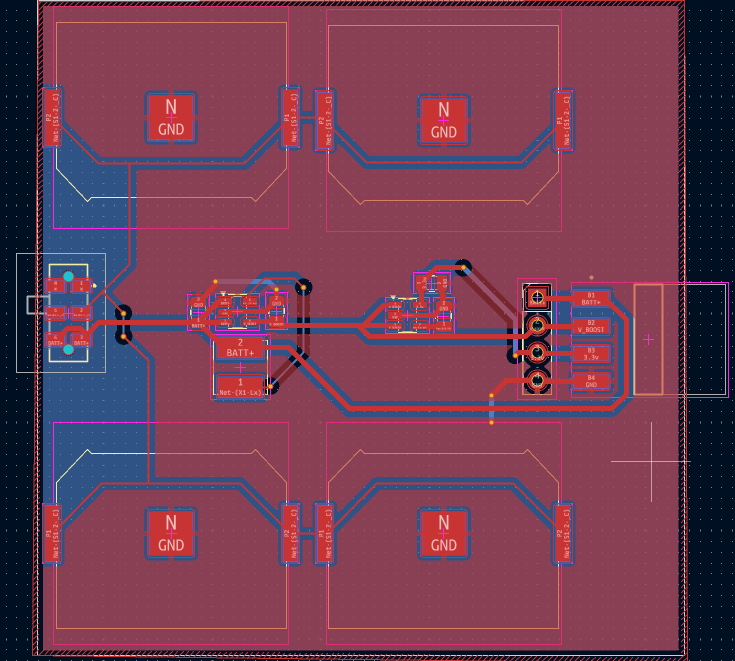

# Power Board

<div align="center">



### CR2032-Based Power Distribution Board for Embedded Systems

A compact power distribution module designed to supply embedded systems, sensor boards, and IoT devices using four CR2032 coin cells connected in parallel.

</div>

---

# Overview

The Power Board is a custom PCB developed to provide a compact and reliable power source for low-power embedded systems.

The board utilizes four CR2032 coin cell batteries connected in parallel, increasing the overall battery capacity and operational lifetime while maintaining a nominal output voltage of approximately 3V.

Power is distributed through dedicated header connectors, allowing multiple sensor boards, communication modules, and embedded subsystems to be powered from a single battery source.

The board was designed in KiCad, fabricated through a PCB manufacturer, hand assembled, and successfully tested as part of a complete hardware development workflow.

This project demonstrates PCB design, power distribution design, fabrication, assembly, and hardware validation.

---

# Project Status

This board has been:

- Designed in KiCad
- Fabricated through a PCB manufacturer
- Hand assembled and soldered
- Battery output verified
- Header connectivity tested
- Successfully hardware validated

The project demonstrates the complete hardware development lifecycle from schematic capture and PCB layout to fabrication, assembly, and testing.

---

# Features

- 4 × CR2032 Coin Cell Battery Support
- Parallel Battery Configuration
- Extended Battery Life
- Multiple Power Distribution Headers
- Compact PCB Design
- Embedded System Integration
- Fabricated and Assembled Hardware
- Hardware Tested and Validated
- Reusable Power Distribution Module

---

# PCB Preview

## Board Layout


# Hardware Specifications

| Parameter | Value |
|------------|---------|
| Power Source | 4 × CR2032 Coin Cells |
| Configuration | Parallel |
| Output Voltage | ~3V |
| Function | Power Distribution |
| PCB Layers | 2 |
| Design Tool | KiCad |
| Distribution Method | Header Connectors |
| Status | Fabricated, Assembled & Tested |

---

# Working Principle

The board utilizes four CR2032 coin cell batteries connected in parallel to increase overall battery capacity and operating lifetime.

The battery output is distributed through dedicated header connectors, enabling multiple embedded modules to be powered from a single compact power source.

The design serves as a reusable power distribution module for:

- Sensor Boards
- Microcontrollers
- Communication Modules
- RTC Modules
- Data Logging Systems
- Battery-Powered Embedded Projects

By using a parallel battery configuration, the system achieves significantly longer operating time compared to a single CR2032 cell while maintaining the same output voltage.

---

# Applications

- Embedded Systems
- Sensor Networks
- IoT Devices
- Smart Agriculture
- Data Logging Systems
- Wearable Electronics
- Portable Embedded Projects
- Low-Power Monitoring Systems
- Battery-Powered Prototypes

---

# Design Goals

The project was developed to:

- Create a reusable battery-powered distribution board
- Extend battery runtime through parallel cell configuration
- Simplify powering multiple embedded modules
- Practice PCB design and routing techniques
- Gain experience in fabrication and assembly workflows
- Develop supporting hardware for larger projects

---

# Manufacturing Files

This repository contains:

- Gerber Files
- Drill Files
- PCB Images
- Schematic Documentation

The fabrication files can be directly uploaded to:

- JLCPCB
- PCBWay
- NextPCB
- OSH Park

---

# Repository Structure

```text
Power_Board/
├── README.md
├── images/
│   ├── Board.png
├── docs/
│   └── Schematic.pdf
└── fabrication/
    ├── Gerber Files
    ├── Drill Files
    ├── Job File
    └── PowerBoard_Gerbers.zip
```

---

# Tools Used

- KiCad
- Git
- GitHub

---

# Hardware Validation

✔ Schematic Designed

✔ PCB Layout Completed

✔ Fabricated

✔ Hand Assembled

✔ Battery Output Verified

✔ Header Connectivity Verified

✔ Successfully Hardware Validated

---

# Skills Demonstrated

- PCB Design
- Schematic Capture
- Component Placement
- PCB Routing
- Power Distribution Design
- Design for Manufacturing (DFM)
- Hardware Assembly
- Hardware Testing & Validation
- Battery-Powered System Design

---

# Future Improvements

- Battery Monitoring Circuit
- Low Battery Indicator
- Reverse Polarity Protection
- Power Switch Integration
- Compact Revision
- Current Monitoring Capability

---

# License

Shared for educational and hardware development purposes.

---

<div align="center">

Designed, Fabricated, Assembled, and Tested using KiCad

</div>
